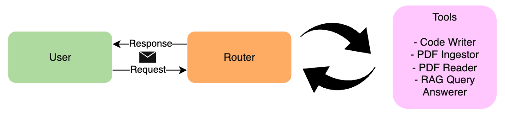
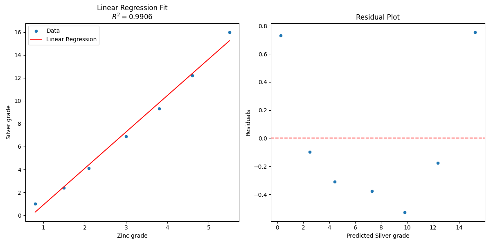
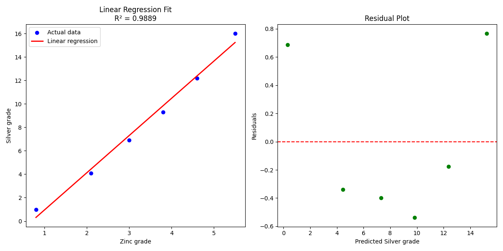
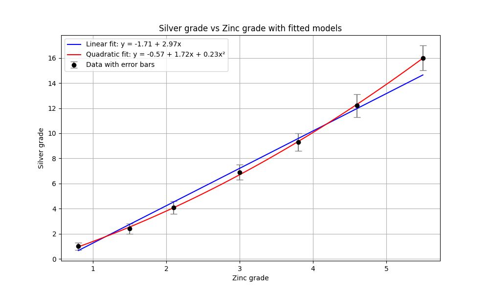
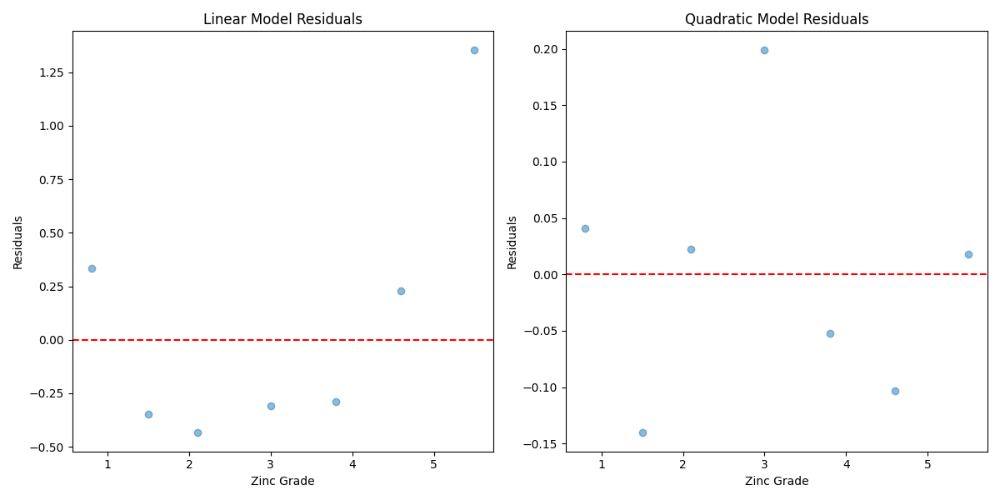
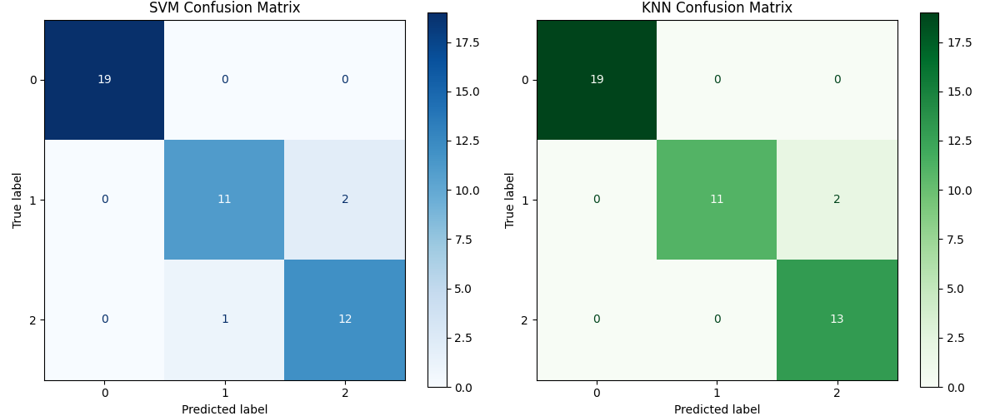
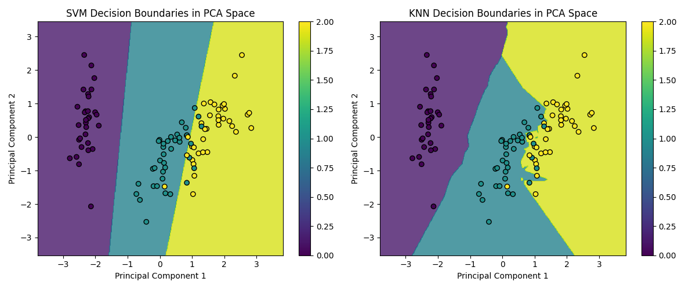

# Small Agent with PDF Reading and Coding Capability

## Motivation
This is a small project exploring how large language models can be used to perform actions directly on a machine to perform Data Science task.

- **Primary objective**: Learn about Generative AI and its automation potential. While more advanced products already exist (e.g., Cursor), this project focuses on building an agentic system from scratch, without relying on frameworks such as `LangGraph` or external state management tools.
- **Low-cost agent design**: Instead of relying on large multimodal models for every task—which can be expensive—this project explores whether a coordinated loop of smaller, specialized agents can be more cost-effective and equally effective.
- **Fully autonomous and self-correcting**: Many tasks, such as data science workflows, require feedback loops. Observing intermediate results (e.g., data outputs) should influence subsequent actions, including how code is generated.

## Methods
### Components
To achieve all of the above the following components are built

#### 1. Router
The Router is the central orchestration component responsible for controlling tool execution and decision-making in the system. It acts as an autonomous agent that interprets the user’s goal, evaluates intermediate results, and decides the next single action required to progress toward task completion. It receives the main goal and output a JSON of the next step required or the answer to the main goal.

#### 2. Tools
- **Code Writer** Generates and executes self-contained Python scripts to solve a single, well-defined subtask designated by the router. It will ask for human in the loop feedback before running it locally, and optionally persist results as artifacts for downstream tools.

- **Data Reader**: Loads structured CSV data into memory and summarizes its schema. The serializes the full DataFrame as a reusable artifact, enabling other agents to perform analysis without reloading the original file.

- **PDF Ingestor**
Transforms PDF documents into a searchable knowledge base for retrieval-augmented generation (RAG). It splits large PDFs, partitions them into semantically meaningful text chunks using Unstructured library, and stores its embeddings with rich metadata in ChromaDB vector database.

- **RAG Query Answerer**
Answers natural-language questions using retrieval-augmented generation. It generates responses strictly grounded in retrieved context—returning "none" when the answer cannot be supported by the documents.

- **PDF Reader**
Reads PDF documents sequentially and extracts raw text without semantic indexing. This tool is intended for cases where the full document must be read in order and semantic search is unnecessary or inefficient.

- **PDF Splitter**
Splits large PDF files into smaller, page-preserving segments. This tool is used when a document is too large to process as a single unit or when all content must be retained exactly as-is.


The tool always interact with the router in a feedback loop
<p align="center">
  
</p>

###

### Models
The final model chosen is:
| Component | Model | Remark |
| -- | -- | -- |
| Router | mistralai/mistral-small-3.1-24b-instruct:free | $0 / M input, $0 / M output in OpenRouter | 
| Code Writer | mistralai/devstral-2512:free | $0 in OpenRouter |
| RAG Query Answerer | mistralai/mistral-small-3.1-24b-instruct:free | $0 / M input, $0 output in OpenRouter |
| RAG Embedding | Qwen/Qwen3-Embedding-0.6B | Running Locally in MacBook Air |
| RAG Reranker | cross-encoder/ms-marco-MiniLM-L-6-v2 | Running Locally in MacBook Air |

With end cost of **$0** per query as of December 2025.

## Learning Points

- Code continuation: A key challenge was passing intermediate objects (called artifacts in this repository) between scripts generated and executed sequentially by agents. While frameworks such as LangGraph can pass objects between agents, they require the execution graph and code to be predefined and compiled ahead of time. This approach does not work well for dynamically generated code, where each step ideally runs in an isolated sandbox. To enable state transfer between sequential code_writer executions, pickle files were used as an explicit persistence mechanism. Two approaches were explored:
    1. Router-mediated context passing:
    The code_writer agent returned artifacts to the `Router`, which then summarized and forwarded the relevant context to the next agent. In practice, this proved unreliable: the `Router` sometimes omitted critical details, causing information loss between agent executions.
    In practice this is done by putting this in the `Router` component:
        ```text
        Put a VERY DETAILED description of the artifacts from previous run so that the next program know what it is including variable name of objects and a full schema
        ```
    2. Deterministic artifact paths with stdout descriptions (final solution):
    Artifact paths were generated deterministically in advance (e.g., `code_writer3.pkl`, `pdf_reader1.pkl`). Each `code_writer` script was responsible for writing its output to the predefined artifact path, and printing a clear, structured description of that artifact to stdout. The next `code_writer` could then directly load the artifact and rely on the printed description for context. This approach has two key advantages:

        - It avoids over-reliance on the Router to accurately summarize prior state.
        - Since the model is specialized for code generation, it is better able to interpret and build upon artifacts it previously created.
    In practice this is done by putting this in the `code_writer` tool:
        ```text
        print a VERY DETAILED description of the object to stdout so that the next program know what it is including variable name of objects and a full schema
        ```

    As a result of this, in end of task 3, the ends the whole script this codeblock that uses the output of all previous results:
    ```
    with open('data/code_writer3.pkl', 'rb') as f:
        linear_metrics = pickle.load(f)

    with open('data/code_writer4.pkl', 'rb') as f:
        linear_r2 = pickle.load(f)

    with open('data/code_writer6.pkl', 'rb') as f:
        quadratic_metrics = pickle.load(f)

    with open('data/code_writer7.pkl', 'rb') as f:
        quadratic_r2 = pickle.load(f)

    with open('data/code_writer8.pkl', 'rb') as f:
        plot_data = pickle.load(f)
    ```
- Prompt engineering is critical in agentic systems.
    - In interactive chat interfaces, a poorly phrased prompt can often be corrected in a follow-up message. In automated systems, however, error recovery is much harder.
    - Prompts should strike a balance: they should neither attempt to do too much nor be overly minimal. In this system, a single Router that decides both the tool and its arguments provides a good balance. Splitting this responsibility across multiple LLMs (one for tool selection and another for argument generation) introduces coordination issues and tends to be unreliable. That said, specialized tools such as `code_writer` and `query_answerer` still require their own dedicated prompts.
    - Prompts must avoid ambiguous or conflicting instructions that leave room for interpretation.

- Instruction following remains challenging for smaller, non–fine-tuned models.
    - In Task 5, mistralai/mistral-small-3.1-24b-instruct:free generated over 100 lines of code despite an explicit 50-line limit. Replacing it with qwen/qwen3-235b-a22b-2507 resulted in the task being decomposed into smaller, more manageable subtasks.
    - Some prompt constraints may be partially ignored, such as strict output formatting requirements (e.g., JSON-only responses without the ` ```json ` markdown fence).
    - Even with careful prompting, certain behaviors—such as enforcing deterministic output paths for code_writer—still need to be programmatically enforced, as the model may otherwise invent file paths.
- Fewer agents are often better than more.
    - Each additional agent increases the risk of hallucinations propagating through the system and causing cascading failures. 
    - For example, when querying the Harry Potter book, a MultiQueryExpansion approach could retrieve multiple passages from different parts of the story. This can introduce conflicting information (e.g., early suspicion of Snape versus the later reveal that Quirrell is responsible). If both chunks are retrieved simultaneously, the system may struggle to determine the correct ground truth.

## Results
The system is tested on 5 different tasks with different and below are the results.

### Simple Linear regression
The model perform a simple Linear Regression with one script.

Prompt:
```md
Do a linear regression from data/data.csv and plot the curve fit, including residual plot and R^2 value
```
Answer:
```md
Linear regression analysis has been completed using 'Zinc grade' as the predictor and 'Silver grade' as the response variable. The model achieved an R^2 value of 0.9906. The curve fit plot and residual plot have been generated and saved. All results, including the model, residuals, and plots, are available in the artifact.
```

Result:


### Linear regression with dirty data
Allowing the model to execute its own code enables it to detect that one of the data points is missing and automatically filter it out.


### Read the whole Harry Potter book and answer a question

Prompt:

```
Read the book in data/some_book.pdf and tell me who tried to steal the stone.
```

Because the system has RAG retrieval capabilities, the model correctly performs the following sequence of actions:
- PDF Read (failed): The PDF Reader attempts to read the document but returns an error because it is programmed to reject documents that exceed a word-count threshold.
- PDF Ingest: The model correctly determines that the document should be ingested into the RAG pipeline to enable semantic search.
- RAG Retrieval and Answering: The Router issues the query “Who tried to steal the stone in the book?” against the vector database. The RAG retrieves the relevant passage from the book and returns the correct answer: `Professor Quirrel tried to steal the stone.`

###  Read an assignment PDF and a CSV, then do the assignment

Prompt:
```
Do the assignment from data/Assignment.pdf the data is available in data/data.csv
```

In this case, the agent first reads the assignment and loads the CSV file, then applies a divide-and-conquer approach—solving the linear model first, followed by the quadratic model, and finally comparing the two models.

- PDF read: Loaded and extracted the assignment instructions.
- CSV data read: Loaded the zinc grade, silver grade, and silver grade error data into a pandas DataFrame.
- Weighted linear fit (failed attempt): Attempted weighted linear regression using incorrect column names, resulting in a __KeyError__.
- Weighted linear fit (corrected): Implemented weighted normal equations to fit $$y = a + bx$$
- Linear RMS error computation: Calculated residuals for the linear model and computed the RMS error.
- Linear R² computation: Computed (R²) for the linear fit.
- Weighted quadratic fit: Constructed a quadratic design matrix and solved weighted normal equations to fit $$y = a + bx + cx^2$$
- Quadratic RMS error computation: Calculated residuals and RMS error for the quadratic model.
- Quadratic R² computation: Computed the (R²) for the quadratic fit.
- Plot generation: Saved a plot with data points with error bars, the linear fit, and the quadratic fit.
- Model comparison and interpretation: Compared RMS error and R² between models, identified the quadratic model as superior, and generated residual plots for diagnostic analysis.





###  Do SVM and KNN on Iris dataset

The system is prompted with:

```
Load iris dataset from sklearn, Do a SVM and KNN comparison, visualize the confusion matrix and decision boundaries in PCA space, make sure all charts are labelled
```

And even though the inconsistent color, it output correctly generate:



### Limitations
- The effectiveness of an agentic system is highly dependent on the underlying model’s capabilities, particularly its ability to follow instructions. Fine-tuning the Router to reliably produce a strict output format would significantly improve system robustness.
- There are currently no well-established metrics for evaluating or comparing agentic system performance.